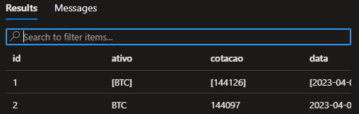
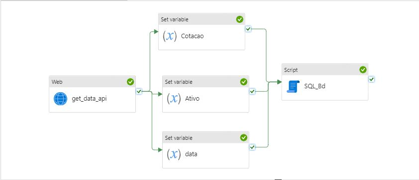
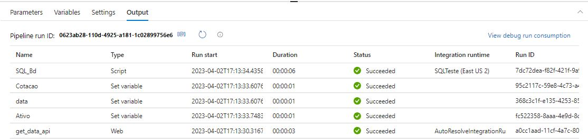

# Projeto ETL 1.0 - etl-ativo-btc
<!-- ### ETL realizado na cloud Azure consumindo dados de API - Awesome API disponível em  --> https://economia.awesomeapi.com.br/last

## Consumindo API de cotação de criptomoedas e inserindo dados em tabela SQL Server
### Objetivo
A pipeline tem como objetivo obter dados de uma API externa que fornece cotações de criptomoedas em tempo real e armazená-los em uma tabela SQL Server para posterior análise.

### Atividades da pipeline - Definições
A pipeline é composta por três atividades principais:

Atividade "Web"
A atividade "Web" consome a API externa que fornece dados de cotação de criptomoedas.
Ela recebe como entrada uma URL que representa a chamada à API e retorna os dados da cotação em um formato JSON.

Na pipeline em questão, a URL usada é https://economia.awesomeapi.com.br/last/BTC-BRL, que retorna os dados de cotação da criptomoeda Bitcoin (BTC) em relação ao real brasileiro (BRL).

Atividade "Set Variable"

A atividade "Set Variable" extrai os valores relevantes dos dados de cotação obtidos pela atividade "Web" e os armazena em variáveis para uso posterior na pipeline.

Nesta pipeline, a atividade "Set Variable" armazena os seguintes valores em variáveis:

ativo: a sigla da criptomoeda (BTC).
cotacao: o valor da cotação da criptomoeda em relação ao real brasileiro.
data: a data e hora da cotação.

Atividade "Script"

A atividade "Script" insere os dados de cotação da criptomoeda em uma tabela SQL Server por meio de uma consulta SQL personalizada.

A consulta SQL tem a seguinte sintaxe:

## Pipeline de consumo de API de cotação de criptomoedas

### Atividade Web

A atividade Web utiliza o método HTTP GET para acessar a API de cotação de criptomoedas no seguinte endereço: https://economia.awesomeapi.com.br/last/BTC-BRL. Ela obtém os dados de cotação atualizados da criptomoeda Bitcoin em relação ao Real brasileiro.

### Atividade Set Variable

A atividade Set Variable define três variáveis: "ativo", "cotacao" e "data", com base nos dados obtidos pela atividade Web. Ela utiliza o seguinte código no campo "value" do setting:

@{activity('get_data_api').output.BTCBRL.code}
@{activity('get_data_api').output.BTCBRL.ask}
@{formatDateTime(activity('get_data_api').output.BTCBRL.create_date, 'yyyy-MM-dd HH:mm:ss')}

Colunas esperadas:

Id   | ativo | cotacao | data 
---- | ----- |---------|-----

### Atividade Script

A atividade Script executa uma consulta SQL para inserir os dados de cotação obtidos pela atividade Set Variable em uma tabela do banco de dados. Ela utiliza o seguinte código no campo "query" do setting:

~~~SQL
INSERT INTO dbo.cotacoes (ativo, cotacao, data) VALUES ('@{variables('ativo')}', '@{variables('cotacao')}', '@{variables('data')}')
~~~

Essa consulta insere os valores das variáveis "ativo", "cotacao" e "data" na tabela "cotacoes" do banco de dados.

Ela insere um novo registro na tabela cotacoes do banco de dados, com os valores armazenados nas variáveis ativo, cotacao e data. A sintaxe @{variables('...')} é usada para acessar os valores das variáveis armazenadas pela atividade "Set Variable" e usá-los como parâmetros na consulta SQL.

Exemplo de banco de dados populado:

### Fluxo de Execução
A atividade "Web" é executada e consome a API externa que fornece dados de cotação de criptomoedas.
Os valores relevantes dos dados de cotação são extraídos pela atividade "Set Variable" e armazenados nas variáveis ativo, cotacao e data.
A atividade "Script" é executada e insere os valores armazenados nas variáveis na tabela cotacoes do banco de dados.
Conclusão
A pipeline consome uma API externa que fornece dados de cotação de criptomoedas, extrai os valores relevantes dos dados e os armazena em variáveis, e insere esses valores em uma tabela SQL Server por meio de uma consulta SQL personalizada. 

A imagem abaixo ilustra o fluxo do pipeline do datafactory:

Exemplo dos outoputs esperados:

